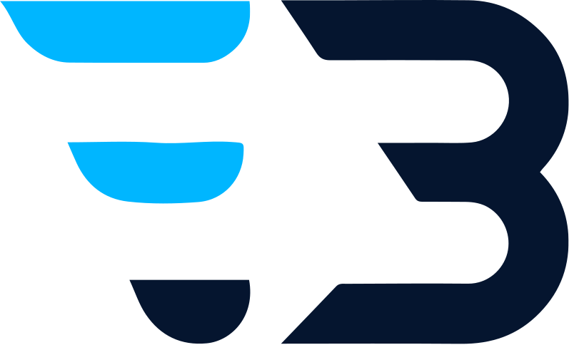

# Bilal Eneouisser - Portfolio Website

A modern, responsive portfolio website showcasing the work and expertise of **Bilal Eneouisser**, a Full Stack Developer and UI/UX Designer specializing in React.js, Laravel, WordPress, and modern web technologies.



## 🚀 **Live Demo**
[View Live Portfolio](https://your-portfolio-url.com)

## ✨ **Key Features**

### 🏠 **Homepage (`index.html`)**
- **Hero Section** - Animated typing effect with call-to-action
- **About Section** - Professional background with statistics
- **Services Showcase** - Web Development, UI/UX Design, Graphic Design, Branding
- **Skills & Technologies** - Interactive skill display
- **Portfolio Gallery** - 18+ projects with category filtering (3-3-1 mobile layout)
- **Experience Timeline** - Professional journey and education
- **Client Testimonials** - Mobile-optimized slider
- **Blog Preview** - Latest articles with enhanced mobile display
- **Contact Section** - WhatsApp integration with hover animations

### 📝 **Blog System**
- **Main Blog Page** (`/blog.html`) - All blog posts with category filtering
- **Individual Blog Posts** - 3 detailed articles with navigation
- **Category System** - Web Development, UI/UX Design, E-commerce
- **Enhanced Mobile Experience** - Optimized content display and social media buttons

#### **Current Blog Posts:**
1. **Top UI Trends Designers Must Know** - Modern design principles and trends
2. **Future of Web Development in 2025** - AI, performance, and modular architecture
3. **Best CMS Platforms for Online Growth** - WordPress, Shopify, and alternatives

### 🎨 **Portfolio Projects (18 Projects)**
- **Web Development Projects:**
  - Odoo Business Management Landing Page
  - MADGICS Agency Landing Page
  - Blassa Grand Taxi App
  - Artcoustic Agency Landing Page
  - Starters Landing Page
  - Otof Project Website
  - Farabi Doctors App
  - Car Rental System
  - Commune Ain Kansara Website
  - E-Task Gestion System
  - Stock Management System

- **E-commerce Projects:**
  - DivineOfficiel (Cosmetics & Health)
  - Croc Sec (Fruits Secs & Noix)

- **Design & Branding Projects:**
  - Brandenburginstitut Instagram Posts
  - Al Bayan Academy Instagram Posts
  - SGG Branding & Visual Identity

### 🌐 **Technical Features**
- **Theme System** - Dark/Light mode toggle with purple logo in light mode
- **Responsive Design** - Mobile-first approach with 3-3-1 portfolio filter layout
- **Performance Optimized** - Fast loading with optimized assets
- **SEO Ready** - Meta tags, sitemap, robots.txt, manifest.json
- **PWA Compatible** - Progressive Web App features
- **Accessibility** - ARIA labels and semantic HTML

### 📊 **Google Analytics Integration**
- **Measurement ID**: `G-CR7TYTMB1M`
- **Enhanced Tracking**:
  - Portfolio entry and project views
  - CV downloads
  - Scroll depth (25%, 50%, 75%, 90%)
  - Time on site
  - Contact form interactions
  - Social media clicks
  - Portfolio filter usage
  - Blog engagement metrics

## 🛠️ **Technologies Used**

### **Frontend**
- HTML5, CSS3, JavaScript (ES6+)
- CSS Grid & Flexbox for layouts
- CSS Custom Properties (variables)
- CSS Animations & Transitions
- Responsive design with media queries

### **Libraries & Frameworks**
- Font Awesome 6.4.0 (Icons)
- Google Fonts (Inter font family)
- Swiper.js (Testimonials slider)
- Google Analytics 4 (gtag.js)

### **Design & UX**
- Modern glassmorphism effects
- Smooth hover animations
- WhatsApp button sending animation
- Mobile-optimized navigation
- Touch-friendly interactions

## 📁 **Project Structure**

```
project_portfolio_Bilal-main/
├── index.html                    # Main homepage
├── blog.html                     # Main blog page
├── blog-posts/                   # Individual blog posts
│   ├── top-ui-trends-designers-must-know.html
│   ├── future-of-web-development-2025.html
│   └── best-cms-platforms-online-growth.html
├── projects/                     # Individual project pages (18 files)
│   ├── almoumen-academy.html
│   ├── odoo-business.html
│   ├── madgics-agency.html
│   ├── blassa-taxi.html
│   ├── artcoustic-agency.html
│   ├── starters-landing.html
│   ├── otof-project.html
│   ├── farabi-doctors.html
│   ├── farabi-health.html
│   ├── car-rental.html
│   ├── commune-ain-kansara.html
│   ├── etask-gestion.html
│   ├── stock-management.html
│   ├── brandenburginstitut.html
│   ├── al-bayan-academy.html
│   ├── divine-officiel.html
│   ├── croc-sec.html
│   └── sgg-branding.html
├── assets/
│   ├── css/
│   │   ├── style.css            # Main stylesheet
│   │   ├── responsive.css       # Responsive styles
│   │   ├── blog-posts.css       # Blog-specific styles
│   │   └── project-pages.css    # Project page styles
│   ├── js/
│   │   └── main.js              # Main JavaScript with enhanced tracking
│   ├── img/
│   │   ├── logo/                # Logo and favicon
│   │   ├── portfolio/           # Project images
│   │   ├── blogs/               # Blog post images
│   │   ├── banner.jpg           # CTA banner background
│   │   └── favicon/             # PWA icons
│   └── cv/                      # CV download file
├── sitemap.xml                  # SEO sitemap
├── robots.txt                   # Search engine directives
├── manifest.json                # PWA manifest
└── README.md                    # This file
```

## 🚀 **Getting Started**

### **Local Development**
1. **Clone the repository**
   ```bash
   git clone [your-repository-url]
   cd project_portfolio_Bilal-main
   ```

2. **Open in browser**
   - Open `index.html` in your web browser
   - Navigate through different sections
   - Test responsive design on different screen sizes

3. **Test Features**
   - Toggle between dark/light themes
   - Navigate to individual project pages
   - Read blog posts
   - Test contact form and WhatsApp integration
   - Verify Google Analytics tracking

### **Deployment**
1. **Upload all files** to your web hosting service
2. **Verify Google Analytics** is working (check in 24-48 hours)
3. **Test all pages** and functionality
4. **Update sitemap** if you add new content

## 🎨 **Customization Guide**

### **Adding New Projects**
1. Create new HTML file in `projects/` directory
2. Follow existing structure from other project files
3. Add project images to `assets/img/portfolio/`
4. Update navigation links between projects
5. Include Google Analytics tracking code

### **Adding New Blog Posts**
1. Create new HTML file in `blog-posts/` directory
2. Follow existing blog post structure
3. Add blog images to `assets/img/blogs/`
4. Update navigation between posts
5. Include Google Analytics tracking code

### **Modifying Styles**
- **Main styles**: `assets/css/style.css`
- **Responsive styles**: `assets/css/responsive.css`
- **Project pages**: `assets/css/project-pages.css`
- **Blog posts**: `assets/css/blog-posts.css`

### **Google Analytics Updates**
- **Measurement ID**: Update `G-CR7TYTMB1M` in all HTML files
- **Custom tracking**: Modify `custom_map` parameters in `main.js`
- **Event tracking**: Add new `gtag('event')` calls as needed

## 📱 **Responsive Design Features**

### **Mobile Optimizations**
- **Portfolio Filters**: 3-3-1 horizontal layout on mobile
- **Testimonials**: Single card display with proper swipe functionality
- **Blog Cards**: Enhanced mobile content display
- **Social Media**: Horizontal layout in contact section
- **Navigation**: Mobile-friendly header with theme toggle

### **Breakpoints**
- **Mobile**: < 768px
- **Tablet**: 768px - 1024px
- **Desktop**: > 1024px

## 🔍 **SEO & Performance**

### **SEO Features**
- Semantic HTML5 structure
- Meta tags and descriptions
- XML sitemap with all pages
- Robots.txt configuration
- Favicon and PWA manifest
- Clean URL structure

### **Performance Optimizations**
- Optimized images and assets
- Efficient CSS and JavaScript
- Lazy loading for images
- Smooth animations with CSS
- Fast loading times

## 🌐 **Browser Support**

- **Chrome** (latest) ✅
- **Firefox** (latest) ✅
- **Safari** (latest) ✅
- **Edge** (latest) ✅
- **Mobile browsers** (iOS Safari, Chrome Mobile) ✅

## 📊 **Analytics & Tracking**

### **What's Tracked**
- **Page Views**: Every page visit with custom titles
- **User Interactions**: Clicks, form submissions, downloads
- **Engagement**: Scroll depth, time on page, navigation
- **Portfolio**: Project views, filter usage, CTA clicks
- **Blog**: Article reads, category filters, navigation
- **Contact**: WhatsApp clicks, email submissions, social media

### **Analytics Setup**
- **Google Analytics 4** with enhanced tracking
- **Real-time data** available in GA dashboard
- **Custom parameters** for detailed insights
- **Event tracking** for user interactions

## 📞 **Contact Information**

- **Email**: eneouisserbilal@gmail.com
- **Phone**: +212 6 22 60 84 35
- **WhatsApp**: [Direct Chat Link](https://wa.me/212622608435)
- **Location**: Rabat, Morocco
- **LinkedIn**: [Bilal Eneouisser](https://www.linkedin.com/in/bilal-eneouisser-14b62a202/)
- **GitHub**: [BilalEnenouisser](https://github.com/BilalEnenouisser)
- **Instagram**: [@bilaleneouisser](https://www.instagram.com/bilaleneouisser/)

## 🤝 **Contributing**

This is a personal portfolio website, but suggestions and feedback are welcome. Please feel free to:
- Report bugs or issues
- Suggest improvements
- Share feedback on design or functionality

## 📄 **License**

© 2025 Bilal Eneouisser. All rights reserved.

This portfolio website is created to showcase professional work and should not be copied or redistributed without permission.

---

**Built with ❤️ and modern web technologies**
